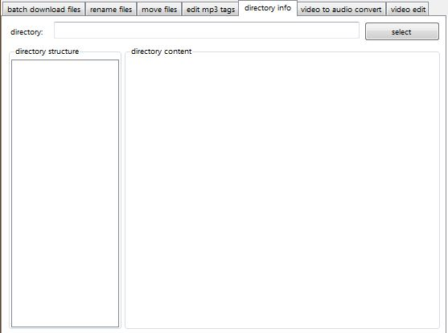

# WinUtil
 A small windows desktop application with various utility functions.

 ## Get and install

 You can find the current version (any CPU) on the [release-page](https://github.com/nfbyfm/WinUtil/releases). 
 Download the zip file beginning with 'WinUTil', unzip wherever you want and simply double click on WinUtil.exe (no installation required).

 Alternatively you can download the current source code / solution and build the executable yourself in VisualStudio.

 ## Functions

The application consists of two main parts: The upper half, where the main functions are arranged in tab pages, and the lower half, where a console like output shows you information about the current tasks.

A short overview of the functions:

| function    | description |
| -------- | ------- |
| [auto download] | monitors the clipboard and downloads files automatically |
| [batch download files](#batch-download)  | downloads a list of files from the internet  |
| [rename files](#rename-files) | renmames a list of files at once     |
| [move files](#move-files)    | moves a list of files into a single directory |
| [edit mp3 tags](#edit-mp3-tags) | sets the tags of multiple mp3 files |
| [directory info](#directory-info) | shows size and structure of a given directory |
| [video to audio](#video-to-audio) | converts (a section) of a video into a audio file |
| [video edit](#video-edit) | cuts and or rotates a given video file |

The last two functions require for you to have a copy of ffmpeg ([download here](https://ffmpeg.org/download.html)) and have set the path to the executable file in the settings of WinUtil.

 ### auto download

 The 'auto download' function allows you to automatically download files, whose links you've copied into the clipboard.
 
 

 First activate / click once on the 'monitor clipboard' button. After that - using your web browser for example-, you simply copy the url of whatever you wish to download into your clipboard. 
 The program, runing in the backgroud, will automatically  create a directory named after the url host name in your downloads folder and save the file into it.

 ### batch download

 If you have a list of files you would like to download, the 'batch download files' function is for you:

 

 Dump the list of hyperlinks into the upper part, set the download directory and options and then click the 'start' button.

 ## rename files

 In the 'rename files' tab you can select a directory with files, which you want to rename by certain criteria:

  

  ## move files

  In the 'move files' tab you can move a list of files to a specific directory:

  

  Compared to the normal explorer functions, this lets you set the list of files by your own criteria.

  ## edit mp3 tags

  The function 'edit mp3 tags' lets - as the name suggests - edit the tags of multiple mp3 files at once:

  
  
  ## directory info

  In the 'directory info' tab you can get informational data on a specific directory (moslty about its size and the composition of said size in form of a pie diagram):

  
  
  This functionality is still very basic and not optimized. The application might freeze, especially in case of large directories.

  ## video to audio

  The function 'video to audio convert' lets you strip the audio of a whole or part of a video file:

  
  
  This a very simple front end for ffmpeg and accordingly only available, if the path to the ffmeg executable file has been set in the settings.

  ## video edit

  In the 'video edit' you can cut a segment out of and/or rotate a video file:

  
  
  Just like the 'video to audio', this a very simple front end for only a tiny part of the functionality of ffmpeg.
